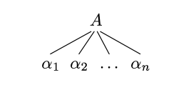

# lab1 实验报告
学号：PB19111692 姓名：袁玉润

## 实验要求

完成`lexical_analyzer.l`, `syntax_analyzer.y`文件空缺部分，实现`cminus`语言的词法分析与语法分析器，生成指定源文件的语法分析树。

## 实验难点

本实验因已完整给出CFG文法，故实验主要难点是理解`flex`, `bison`语法，将正则表达式与CFG文法以正确格式书写于`.l`， `.y`文件。

在维护lexical analyzer的行计数时，需对多行注释做特别处理。此情况容易遗漏。

考虑到不同系统的不同换行符，lexical analyzer在识别换行时应考虑`\n`, `\r`, `\r\n` 3种情况。

## 实验设计

1. Lexical analyzer

   * 识别并返回`token`

     支持一下`token`

     ```
     INT
     FLOAT
     IF
     ELSE
     RETURN
     VOID
     WHILE
     ADD
     MINUS
     MUL
     DIV
     LESS
     LESSEQ
     GREATER
     GREATEREQ
     EQ
     NEQ
     ASSIGN
     SEMICOLON
     COMMA
     LPAREN
     RPAREN
     LBRACKET
     RBRACKET
     LBRACE
     RBRACE
     ID
     INTEGER
     FLOATPOINT
     ERROR
     ```

   * 对一下内容直接删去，不返回`token`

     ```
     \space
     \newline
     \t
     comments
     ```

2. Syntax analyzer

   * CFG
      1. $`\text{program} \rightarrow \text{declaration-list}`$
      2. $`\text{declaration-list} \rightarrow \text{declaration-list}\ \text{declaration}\ |\ \text{declaration}`$
      3. $`\text{declaration} \rightarrow \text{var-declaration}\ |\ \text{fun-declaration}`$
      4. $`\text{var-declaration}\ \rightarrow \text{type-specifier}\ \underline{\textbf{ID}}\ \textbf{;}\ |\ \text{type-specifier}\ \underline{\textbf{ID}}\ \underline{\textbf{[}}\ \underline{\textbf{INTEGER}}\ \underline{\textbf{]}}\ \textbf{;}`$
      5. $`\text{type-specifier} \rightarrow \underline{\textbf{int}}\ |\ \underline{\textbf{float}}\ |\ \underline{\textbf{void}}`$
      6. $`\text{fun-declaration} \rightarrow \text{type-specifier}\ \underline{\textbf{ID}}\ \underline{\textbf{(}}\ \text{params}\ \underline{\textbf{)}}\ \text{compound-stmt}`$
      7. $`\text{params} \rightarrow \text{param-list}\ |\ \underline{\textbf{void}}`$
      8. $`\text{param-list} \rightarrow \text{param-list}\ ,\ \text{param}\ |\ \text{param}`$
      9. $`\text{param} \rightarrow \text{type-specifier}\ \underline{\textbf{ID}}\ |\ \text{type-specifier}\ \underline{\textbf{ID}}\ \underline{\textbf{[}}\ \underline{\textbf{]}}`$
      10. $`\text{compound-stmt} \rightarrow \underline{\textbf{\{}}\ \text{local-declarations}\ \text{statement-list} \underline{\textbf{\}}}`$
      11. $`\text{local-declarations} \rightarrow \text{local-declarations var-declaration}\ |\ \text{empty}`$
      12. $`\text{statement-list} \rightarrow \text{statement-list}\ \text{statement}\ |\ \text{empty}`$
      13. $`\begin{aligned}\text{statement} \rightarrow\ &\text{expression-stmt}\\ &|\ \text{compound-stmt}\\ &|\ \text{selection-stmt}\\ &|\ \text{iteration-stmt}\\ &|\ \text{return-stmt}\end{aligned}`$
      14. $`\text{expression-stmt} \rightarrow \text{expression}\ \underline{\textbf{;}}\ |\ \underline{\textbf{;}}`$
      15. $`\begin{aligned}\text{selection-stmt} \rightarrow\ &\underline{\textbf{if}}\ \underline{\textbf{(}}\ \text{expression}\ \underline{\textbf{)}}\ \text{statement}\\ &|\ \underline{\textbf{if}}\ \underline{\textbf{(}}\ \text{expression}\ \underline{\textbf{)}}\ \text{statement}\ \underline{\textbf{else}}\ \text{statement}\end{aligned}`$
      16. $`\text{iteration-stmt} \rightarrow \underline{\textbf{while}}\ \underline{\textbf{(}}\ \text{expression}\ \underline{\textbf{)}}\ \text{statement}`$
      17. $`\text{return-stmt} \rightarrow \underline{\textbf{return}}\ \underline{\textbf{;}}\ |\ \underline{\textbf{return}}\ \text{expression}\ \underline{\textbf{;}}`$
      18. $`\text{expression} \rightarrow \text{var}\ \textbf{=}\ \text{expression}\ |\ \text{simple-expression}`$
      19. $`\text{var} \rightarrow \underline{\textbf{ID}}\ |\ \underline{\textbf{ID}}\ \underline{\textbf{[}}\ \text{expression} \underline{\textbf{]}}`$
      20. $`\text{simple-expression} \rightarrow \text{additive-expression}\ \text{relop}\ \text{additive-expression}\ |\ \text{additive-expression}`$
      21. $`\text{relop}\ \rightarrow \underline{\textbf{<=}}\ |\ \underline{\textbf{<}}\ |\ \underline{\textbf{>}}\ |\ \underline{\textbf{>=}}\ |\ \underline{\textbf{==}}\ |\ \underline{\textbf{!=}}`$
      22. $`\text{additive-expression} \rightarrow \text{additive-expression}\ \text{addop}\ \text{term}\ |\ \text{term}`$
      23. $`\text{addop} \rightarrow \underline{\textbf{+}}\ |\ \underline{\textbf{-}}`$
      24. $`\text{term} \rightarrow \text{term}\ \text{mulop}\ \text{factor}\ |\ \text{factor}`$
      25. $`\text{mulop} \rightarrow \underline{\textbf{*}}\ |\ \underline{\textbf{/}}`$
      26. $`\text{factor} \rightarrow \underline{\textbf{(}}\ \text{expression}\ \underline{\textbf{)}}\ |\ \text{var}\ |\ \text{call}\ |\ \text{integer}\ |\ \text{float}`$
      27. $`\text{integer} \rightarrow \underline{\textbf{INTEGER}}`$
      28. $`\text{float} \rightarrow \underline{\textbf{FLOATPOINT}}`$
      29. $`\text{call} \rightarrow \underline{\textbf{ID}}\ \underline{\textbf{(}}\ \text{args} \underline{\textbf{)}}`$
      30. $`\text{args} \rightarrow \text{arg-list}\ |\ \text{empty}`$
      31. $`\text{arg-list} \rightarrow \text{arg-list}\ \underline{\textbf{,}}\ \text{expression}\ |\ \text{expression}`$
      
   * 处理代码
      对每个production，形如$A\rightarrow \alpha_1 \alpha_2 \dots \alpha_n$
      语法分析树需如下构建：
   
      
   
      对应至实际代码，表现为
   
      ```c
      $$ = node("A.name", n, $1, $2, ... $n);
      ```

## 实验结果验证

测试样例`2021fall-compiler_cminus/tests/parser/my_tests/test1.cminus`

```c
/**
 * @file test1.cminus
 * @author ryan
 * @brief A test file for c-minus
 * 
 */

float func(int a[], int b)
{
    if (/* inline comment */ func(a + 1, b + 1))
        if (1)
            if (2)
                if (3)
                    a = a + 1;
                else
                    return 1.;
            else
                return 2.;
}
```

输出结果

```
>--+ program
|  >--+ declaration-list
|  |  >--+ declaration
|  |  |  >--+ fun-declaration
|  |  |  |  >--+ type-specifier
|  |  |  |  |  >--* float
|  |  |  |  >--* func
|  |  |  |  >--* (
|  |  |  |  >--+ params
|  |  |  |  |  >--+ param-list
|  |  |  |  |  |  >--+ param-list
|  |  |  |  |  |  |  >--+ param
|  |  |  |  |  |  |  |  >--+ type-specifier
|  |  |  |  |  |  |  |  |  >--* int
|  |  |  |  |  |  |  |  >--* a
|  |  |  |  |  |  |  |  >--* [
|  |  |  |  |  |  |  |  >--* ]
|  |  |  |  |  |  >--* ,
|  |  |  |  |  |  >--+ param
|  |  |  |  |  |  |  >--+ type-specifier
|  |  |  |  |  |  |  |  >--* int
|  |  |  |  |  |  |  >--* b
|  |  |  |  >--* )
|  |  |  |  >--+ compound-stmt
|  |  |  |  |  >--* {
|  |  |  |  |  >--+ local-declarations
|  |  |  |  |  |  >--* epsilon
|  |  |  |  |  >--+ statement-list
|  |  |  |  |  |  >--+ statement-list
|  |  |  |  |  |  |  >--* epsilon
|  |  |  |  |  |  >--+ statement
|  |  |  |  |  |  |  >--+ selection-stmt
|  |  |  |  |  |  |  |  >--* if
|  |  |  |  |  |  |  |  >--* (
|  |  |  |  |  |  |  |  >--+ expression
|  |  |  |  |  |  |  |  |  >--+ simple-expression
|  |  |  |  |  |  |  |  |  |  >--+ additive-expression
|  |  |  |  |  |  |  |  |  |  |  >--+ term
|  |  |  |  |  |  |  |  |  |  |  |  >--+ factor
|  |  |  |  |  |  |  |  |  |  |  |  |  >--+ call
|  |  |  |  |  |  |  |  |  |  |  |  |  |  >--* func
|  |  |  |  |  |  |  |  |  |  |  |  |  |  >--* (
|  |  |  |  |  |  |  |  |  |  |  |  |  |  >--+ args
|  |  |  |  |  |  |  |  |  |  |  |  |  |  |  >--+ arg-list
|  |  |  |  |  |  |  |  |  |  |  |  |  |  |  |  >--+ arg-list
|  |  |  |  |  |  |  |  |  |  |  |  |  |  |  |  |  >--+ expression
|  |  |  |  |  |  |  |  |  |  |  |  |  |  |  |  |  |  >--+ simple-expression
|  |  |  |  |  |  |  |  |  |  |  |  |  |  |  |  |  |  |  >--+ additive-expression
|  |  |  |  |  |  |  |  |  |  |  |  |  |  |  |  |  |  |  |  >--+ additive-expression
|  |  |  |  |  |  |  |  |  |  |  |  |  |  |  |  |  |  |  |  |  >--+ term
|  |  |  |  |  |  |  |  |  |  |  |  |  |  |  |  |  |  |  |  |  |  >--+ factor
|  |  |  |  |  |  |  |  |  |  |  |  |  |  |  |  |  |  |  |  |  |  |  >--+ var
|  |  |  |  |  |  |  |  |  |  |  |  |  |  |  |  |  |  |  |  |  |  |  |  >--* a
|  |  |  |  |  |  |  |  |  |  |  |  |  |  |  |  |  |  |  |  >--+ addop
|  |  |  |  |  |  |  |  |  |  |  |  |  |  |  |  |  |  |  |  |  >--* +
|  |  |  |  |  |  |  |  |  |  |  |  |  |  |  |  |  |  |  |  >--+ term
|  |  |  |  |  |  |  |  |  |  |  |  |  |  |  |  |  |  |  |  |  >--+ factor
|  |  |  |  |  |  |  |  |  |  |  |  |  |  |  |  |  |  |  |  |  |  >--+ integer
|  |  |  |  |  |  |  |  |  |  |  |  |  |  |  |  |  |  |  |  |  |  |  >--* 1
|  |  |  |  |  |  |  |  |  |  |  |  |  |  |  |  >--* ,
|  |  |  |  |  |  |  |  |  |  |  |  |  |  |  |  >--+ expression
|  |  |  |  |  |  |  |  |  |  |  |  |  |  |  |  |  >--+ simple-expression
|  |  |  |  |  |  |  |  |  |  |  |  |  |  |  |  |  |  >--+ additive-expression
|  |  |  |  |  |  |  |  |  |  |  |  |  |  |  |  |  |  |  >--+ additive-expression
|  |  |  |  |  |  |  |  |  |  |  |  |  |  |  |  |  |  |  |  >--+ term
|  |  |  |  |  |  |  |  |  |  |  |  |  |  |  |  |  |  |  |  |  >--+ factor
|  |  |  |  |  |  |  |  |  |  |  |  |  |  |  |  |  |  |  |  |  |  >--+ var
|  |  |  |  |  |  |  |  |  |  |  |  |  |  |  |  |  |  |  |  |  |  |  >--* b
|  |  |  |  |  |  |  |  |  |  |  |  |  |  |  |  |  |  |  >--+ addop
|  |  |  |  |  |  |  |  |  |  |  |  |  |  |  |  |  |  |  |  >--* +
|  |  |  |  |  |  |  |  |  |  |  |  |  |  |  |  |  |  |  >--+ term
|  |  |  |  |  |  |  |  |  |  |  |  |  |  |  |  |  |  |  |  >--+ factor
|  |  |  |  |  |  |  |  |  |  |  |  |  |  |  |  |  |  |  |  |  >--+ integer
|  |  |  |  |  |  |  |  |  |  |  |  |  |  |  |  |  |  |  |  |  |  >--* 1
|  |  |  |  |  |  |  |  |  |  |  |  |  |  >--* )
|  |  |  |  |  |  |  |  >--* )
|  |  |  |  |  |  |  |  >--+ statement
|  |  |  |  |  |  |  |  |  >--+ selection-stmt
|  |  |  |  |  |  |  |  |  |  >--* if
|  |  |  |  |  |  |  |  |  |  >--* (
|  |  |  |  |  |  |  |  |  |  >--+ expression
|  |  |  |  |  |  |  |  |  |  |  >--+ simple-expression
|  |  |  |  |  |  |  |  |  |  |  |  >--+ additive-expression
|  |  |  |  |  |  |  |  |  |  |  |  |  >--+ term
|  |  |  |  |  |  |  |  |  |  |  |  |  |  >--+ factor
|  |  |  |  |  |  |  |  |  |  |  |  |  |  |  >--+ integer
|  |  |  |  |  |  |  |  |  |  |  |  |  |  |  |  >--* 1
|  |  |  |  |  |  |  |  |  |  >--* )
|  |  |  |  |  |  |  |  |  |  >--+ statement
|  |  |  |  |  |  |  |  |  |  |  >--+ selection-stmt
|  |  |  |  |  |  |  |  |  |  |  |  >--* if
|  |  |  |  |  |  |  |  |  |  |  |  >--* (
|  |  |  |  |  |  |  |  |  |  |  |  >--+ expression
|  |  |  |  |  |  |  |  |  |  |  |  |  >--+ simple-expression
|  |  |  |  |  |  |  |  |  |  |  |  |  |  >--+ additive-expression
|  |  |  |  |  |  |  |  |  |  |  |  |  |  |  >--+ term
|  |  |  |  |  |  |  |  |  |  |  |  |  |  |  |  >--+ factor
|  |  |  |  |  |  |  |  |  |  |  |  |  |  |  |  |  >--+ integer
|  |  |  |  |  |  |  |  |  |  |  |  |  |  |  |  |  |  >--* 2
|  |  |  |  |  |  |  |  |  |  |  |  >--* )
|  |  |  |  |  |  |  |  |  |  |  |  >--+ statement
|  |  |  |  |  |  |  |  |  |  |  |  |  >--+ selection-stmt
|  |  |  |  |  |  |  |  |  |  |  |  |  |  >--* if
|  |  |  |  |  |  |  |  |  |  |  |  |  |  >--* (
|  |  |  |  |  |  |  |  |  |  |  |  |  |  >--+ expression
|  |  |  |  |  |  |  |  |  |  |  |  |  |  |  >--+ simple-expression
|  |  |  |  |  |  |  |  |  |  |  |  |  |  |  |  >--+ additive-expression
|  |  |  |  |  |  |  |  |  |  |  |  |  |  |  |  |  >--+ term
|  |  |  |  |  |  |  |  |  |  |  |  |  |  |  |  |  |  >--+ factor
|  |  |  |  |  |  |  |  |  |  |  |  |  |  |  |  |  |  |  >--+ integer
|  |  |  |  |  |  |  |  |  |  |  |  |  |  |  |  |  |  |  |  >--* 3
|  |  |  |  |  |  |  |  |  |  |  |  |  |  >--* )
|  |  |  |  |  |  |  |  |  |  |  |  |  |  >--+ statement
|  |  |  |  |  |  |  |  |  |  |  |  |  |  |  >--+ expression-stmt
|  |  |  |  |  |  |  |  |  |  |  |  |  |  |  |  >--+ expression
|  |  |  |  |  |  |  |  |  |  |  |  |  |  |  |  |  >--+ var
|  |  |  |  |  |  |  |  |  |  |  |  |  |  |  |  |  |  >--* a
|  |  |  |  |  |  |  |  |  |  |  |  |  |  |  |  |  >--* =
|  |  |  |  |  |  |  |  |  |  |  |  |  |  |  |  |  >--+ expression
|  |  |  |  |  |  |  |  |  |  |  |  |  |  |  |  |  |  >--+ simple-expression
|  |  |  |  |  |  |  |  |  |  |  |  |  |  |  |  |  |  |  >--+ additive-expression
|  |  |  |  |  |  |  |  |  |  |  |  |  |  |  |  |  |  |  |  >--+ additive-expression
|  |  |  |  |  |  |  |  |  |  |  |  |  |  |  |  |  |  |  |  |  >--+ term
|  |  |  |  |  |  |  |  |  |  |  |  |  |  |  |  |  |  |  |  |  |  >--+ factor
|  |  |  |  |  |  |  |  |  |  |  |  |  |  |  |  |  |  |  |  |  |  |  >--+ var
|  |  |  |  |  |  |  |  |  |  |  |  |  |  |  |  |  |  |  |  |  |  |  |  >--* a
|  |  |  |  |  |  |  |  |  |  |  |  |  |  |  |  |  |  |  |  >--+ addop
|  |  |  |  |  |  |  |  |  |  |  |  |  |  |  |  |  |  |  |  |  >--* +
|  |  |  |  |  |  |  |  |  |  |  |  |  |  |  |  |  |  |  |  >--+ term
|  |  |  |  |  |  |  |  |  |  |  |  |  |  |  |  |  |  |  |  |  >--+ factor
|  |  |  |  |  |  |  |  |  |  |  |  |  |  |  |  |  |  |  |  |  |  >--+ integer
|  |  |  |  |  |  |  |  |  |  |  |  |  |  |  |  |  |  |  |  |  |  |  >--* 1
|  |  |  |  |  |  |  |  |  |  |  |  |  |  |  |  >--* ;
|  |  |  |  |  |  |  |  |  |  |  |  |  |  >--* else
|  |  |  |  |  |  |  |  |  |  |  |  |  |  >--+ statement
|  |  |  |  |  |  |  |  |  |  |  |  |  |  |  >--+ return-stmt
|  |  |  |  |  |  |  |  |  |  |  |  |  |  |  |  >--* return
|  |  |  |  |  |  |  |  |  |  |  |  |  |  |  |  >--+ expression
|  |  |  |  |  |  |  |  |  |  |  |  |  |  |  |  |  >--+ simple-expression
|  |  |  |  |  |  |  |  |  |  |  |  |  |  |  |  |  |  >--+ additive-expression
|  |  |  |  |  |  |  |  |  |  |  |  |  |  |  |  |  |  |  >--+ term
|  |  |  |  |  |  |  |  |  |  |  |  |  |  |  |  |  |  |  |  >--+ factor
|  |  |  |  |  |  |  |  |  |  |  |  |  |  |  |  |  |  |  |  |  >--+ float
|  |  |  |  |  |  |  |  |  |  |  |  |  |  |  |  |  |  |  |  |  |  >--* 1.
|  |  |  |  |  |  |  |  |  |  |  |  |  |  |  |  >--* ;
|  |  |  |  |  |  |  |  |  |  |  |  >--* else
|  |  |  |  |  |  |  |  |  |  |  |  >--+ statement
|  |  |  |  |  |  |  |  |  |  |  |  |  >--+ return-stmt
|  |  |  |  |  |  |  |  |  |  |  |  |  |  >--* return
|  |  |  |  |  |  |  |  |  |  |  |  |  |  >--+ expression
|  |  |  |  |  |  |  |  |  |  |  |  |  |  |  >--+ simple-expression
|  |  |  |  |  |  |  |  |  |  |  |  |  |  |  |  >--+ additive-expression
|  |  |  |  |  |  |  |  |  |  |  |  |  |  |  |  |  >--+ term
|  |  |  |  |  |  |  |  |  |  |  |  |  |  |  |  |  |  >--+ factor
|  |  |  |  |  |  |  |  |  |  |  |  |  |  |  |  |  |  |  >--+ float
|  |  |  |  |  |  |  |  |  |  |  |  |  |  |  |  |  |  |  |  >--* 2.
|  |  |  |  |  |  |  |  |  |  |  |  |  |  >--* ;
|  |  |  |  |  >--* }
```
