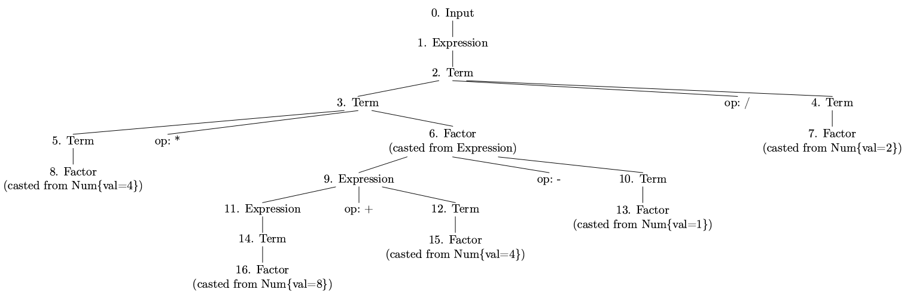

# lab2 实验报告
学号 PB19111692 姓名 袁玉润

## 问题1: cpp 与 .ll 的对应
请说明你的 cpp 代码片段和 .ll 的每个 BasicBlock 的对应关系。

在`.ll`文件中， 每个BasicBlock以标签开头/在函数体首行，以`ret`或`br`语句结束。在`cpp`文件中类似，每个BasicBlock均使用`BasicBlock::create()`函数显式创造，并使用语句`build->set_insert_point()`生成对应`.ll`文件中的label标签、确定后续语句与label标签的位置关系等；在插入新的基本块初始点时，上一基本块生成的IR指令也必须以`br`/`ret`结束。**`.ll`中的每个BasicBlock与`.cpp`中定义的`BasicBlock`对象一一对应**。在跳转语句`br`中，`br`接受参数label，而`cpp`中`build->create_cond_br()`/`build->cread_br()`接受`BasicBlock`对象为参数，其效果一致。

## 问题2: Visitor Pattern
分析 `calc` 程序在输入为 `4 * (8 + 4 - 1) / 2` 时的行为：
1. 请画出该表达式对应的抽象语法树（使用 `calc_ast.hpp` 中的 `CalcAST*` 类型和在该类型中存储的值来表示），并给节点使用数字编号。
   

   注：

   1. 标注数字序号的节点标示一个`CalcASTNode`（或其子类）的实例
   2. 标注有`op`的节点并非一个`CalcASTNode`实例，而是其父节点所表示对象的成员`op`。

2. 请指出示例代码在用访问者模式遍历该语法树时的遍历顺序。

   序列请按如下格式指明（序号为问题 2.1 中的编号）：  
   3->2->5->1

   先序遍历

   ```
   0->
   1->
   2->
   	3->
   		5->
   			8->
   		6->
   			9->
   				11->
   					14->
   						16->
   				12->
   					15->
   			10->
   				13->
   	4->
   		7
   ```

## 问题3: getelementptr
请给出 `IR.md` 中提到的两种 getelementptr 用法的区别,并稍加解释:
  - `%2 = getelementptr [10 x i32], [10 x i32]* %1, i32 0, i32 %0`
  - `%2 = getelementptr i32, i32* %1 i32 %0`

在第一条IR指令中，`%1`的类型为`[10 x i32]*`，使用第一组`<type, index>`计算得到`%1+0*sizeof([10 x i32])`，类型为`i32*`。使用第二组`<type, index>`在第一步结果基础上偏移`(%0)*sizeof(i32)`，`%2`的类型为`i32*`。

在第二条IR指令中，`%1`的类型为`i32*`。`i32 %0`表示在`%1`的基础上偏移`(%0)*sizeof(i32)`，`%2`的类型为`i32*`。

## 实验难点
描述在实验中遇到的问题、分析和解决方案。

1. 在实验步骤1.3.if_hand.ll中，浮点型常量5.555使用float标准无法精确表示，在IR指令中需要手动转成16进制字面量，这个过程比较麻烦。
2. 在阅读`calc_ast.cpp/hpp`时，类之间的继承关系复杂。
3. 在理解`calc_build.cpp`时，被`visit`与`accept`函数关系困扰。`visit`与`accept`相互调用，深感调用关系复杂。

## 实验反馈
吐槽?建议?
