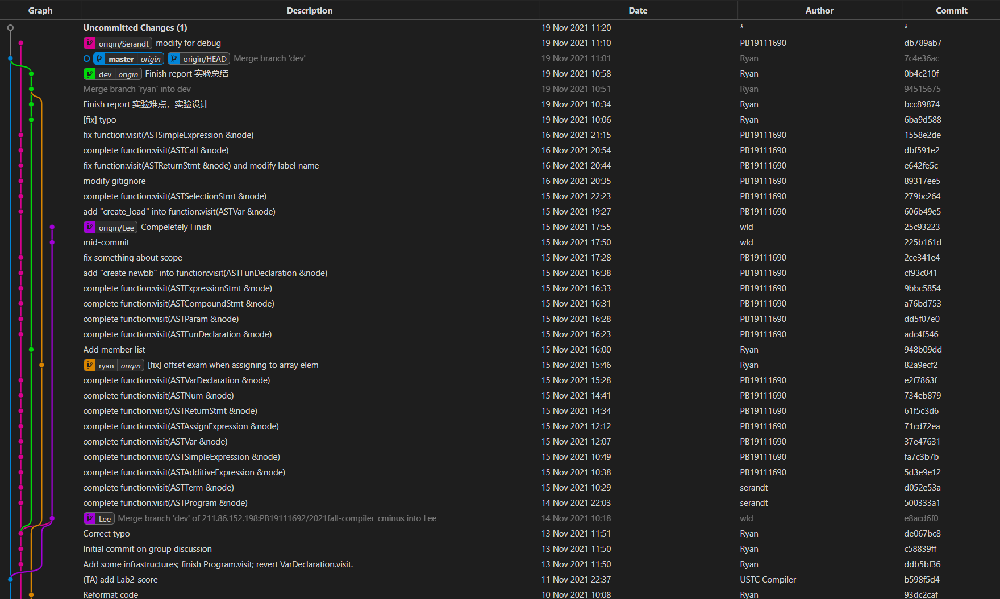

# 组员贡献

## 贡献详述

由于组员们对此次实验有着较高热情，我们并没有将任务划分后分配，而是在交流的同时分别在单独分支上完成自己的版本。所有组员均完成实验的绝大部分甚至全部完成。

在实验过程中，得益于组内交流讨论，实验难度相对降低；各位组员能够了解其他成员的实现方式并做比较；每位组员都完整了解了生成IR的流程，相较于只完成lab3的一部分而言对编译知识掌握更加深刻；组员们在完成实验过程中感受到成就感。

因此，我们决定将贡献分数平均分给每一位组员。

下面是完成过程中的部分Commit记录：

## 评定结果

|名字|百分比|
|:-:|:-:|
|袁玉润|33.3%|
|王历典|33.3%|
|唐志鹏|33.3%|
