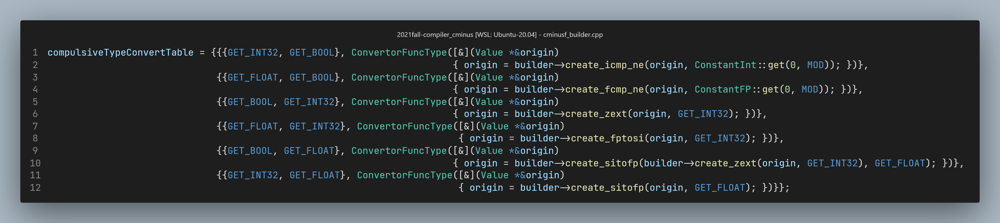

# Lab3 实验报告

> 成员

袁玉润 PB19111692 (组长)

王历典 PB19111691

唐志鹏 PB19111690

## 实验难点

> 实验中遇到哪些挑战

1. 表达式求值：使用全局的栈`cal_stack<Value *>`
   一些细节：栈中保存表达式的值而非指针(这里与`scope`不同，`scope`中需保存变量的指针，以确保可对变量赋值)，这样计算前无需load，且处理字面常量时较为容易。

2. *implicit* 类型转换

3. 函数声明中进入新作用域的时机

   * 难点描述

     在解析函数过程中，应在进入新的作用域后在符号表中添加形参。若在`FuncDeclaration.visit()`中进入新作用域、添加形参，则在`compoundStmt`中需特别判断，避免再次进入新作用域；若在`compoundStmt`中进入新作用域，则需在`compoundStmt`中添加形参。形参列表需要继承而来。

   * 解决方案

     为了统一性，在`compoundStmt`的`visit`函数中进入新作用域(i.e. `scope.enter()`). 
     这样做会遇到一些麻烦：函数参数作用域应在`compoundStmt`的新作用域中，但我们在`compoundStmt`的`visit`中无法直接访问参数列表。我们的做法是使用全局变量将参数列表(的指针)作为继承属性传递。

4. 数组类型转化为指针的时机
   `Ty arr[]`与`Ty *ptr`为不同类型，但在传递参数时、参与运算时(如`arr + n`，虽然我们不用支持这个)前者会隐式转换为后者。
   Solution1：如果数组在表达式中单独成为运算元，则转化为指针类型。即，在`VarDeclaration`中便将数组转换为指针。

   Solution2：由于在cminusf中只有传参时需做此转换，故可在`Call.visit()`中做处理。

5. 类型转换时需考虑`int1`类型

   例如

   ```c
   if (42);
   41 + (1 < 2);
   ```

6. `scope` 中的类型问题
   `scope` 中可能出现`GlobalVariable`, `AllocaInst`, `Function`类型。在取出元素后难以对数据类型判断。
   Solution: 根据查看lightir代码，`GlobalVariable`, `AllocaInst`在`create`时均把变量类型的指针类型作为其`type`域的值。使用`var->get_type()->get_pointer_element_type()`即可得到定义的变量的类型。

7. <span id="terminalstmt">未考虑终止语句的多样性</span>

   例如

   ```c
   if (cond1)
       return;
   else
       return;
   
   
   if (cond1){
       if (cond2)
           return;
       else
           return;
   }
   else
       return;
   ```

   可以看到，除`return`语句以外，一些特殊的`if`语句也可以作为函数结尾(即，函数的最后一条语句)。上述代码中两个`if`语句均是如此，他们在条件为真或假时均会停止运行，其之后的代码均为死代码。

   这对我们的解析造成了障碍：翻译完此类语句后，当前基本块已经结束，不应该在添加`ret/br`语句，也不需要添加BB entry。为了判断是否需要添加`ret/br`语句，我们定义`terminalStmt`的概念，它描述了一组可以作为函数结尾的语句：
   $$
   \begin{array}{lll}
   \textit{terminalStmt}&\rightarrow& \textbf{return}\ \mathit{expr}\\
   &|&\textbf{compound statement}\ \mathit{\{\cdots;\ terminalStmt;\ \cdots\}}\\
   &|&\mathbf{if}\ \mathit{terminalStmt}\ \mathbf{else}\ \mathit{terminalStmt}
   \end{array}
   $$
   当在`compound-statement`中遇到`terminalStmt`是，后续语句可直接跳过。

   此外，这也是为了处理有时无需插入`br`的控制语句。例如

   ```c
   if(expr)
       terminalStmt
   ```

   则`if-statement`结尾除无需再添加`br`指令。

8. `void-function` without `return` statement

   返回值为`void`的函数可以不含`return`语句。
   这一点在使用`terminalStmt`这一概念后十分容易解决。只需要在`functionDeclaration.visit()`中`accept(compond_stmt)`后判断`compound_stmt`是否为`terminalStmt`。若不是，说明它不含`return`语句，此时补充`ret`. 

## 实验设计

> 请写明为了顺利完成本次实验，加入了哪些亮点设计，并对这些设计进行解释。
> 可能的阐述方向有:
>
> 1. 如何设计全局变量
> 2. 遇到的难点以及解决方案
> 3. 如何降低生成 IR 中的冗余
> 4. ...

**部分内容已在[实验难点](#实验难点)中详细说明，如表达式求值使用的栈结构，为处理特殊终止语句设计的`terminal statement`等。**

### 基础设施

一些可以复用的函数、全局变量、宏定义，可以在这里介绍，从而方便其他组员使用，避免重复劳动。

1. 将`enum CminusType`转换为`Type* `类型

   ```cpp
   /**
    * @brief Convert `enum CminusType` to `Type *`
    * @arg builder: just pass the builder in CminusfBuilder to it
    * @arg CminusType: a `enum CminusType` value
    * @return  a `Type *` value. 
    * 
    */
    Type *CminusTypeConvertor(IRBuilder *builder, enum CminusType c);
   ```

2. 强制类型转换

   ```cpp
   /**
    * @brief Compulsively convert value `origin` to `target` type.
    * 
    * e.g. If `a` is of type `int` and has a non-zero value, 
    * `compulsiveTypeConvert(a, GET_BOOL)` will change `a` to 
    * a bool type with value true. 
    * 
    */
    void compulsiveTypeConvert(Value *&origin, Type *target);
   ```

   这里的实现方式使用`std::map<std::pair<Type *, Type *>, std::function<void(Value *&)>>`构建函数表，并将不同类型之间相互转换的方式分别存入表中：

   

3. 提升类型转化

   用于二元运算时的类型转化，将2个运算元转换为二者中较“高级的类型”。

   ```cpp
   /**
    * @brief Convert left/right to the same type
    * 
    * e.g. If left is of type bool, right is of type int, 
    * then left is converted to type int with value 1. 
    * 
    * The rank of types are as following: 
    * 1. float
    * 2. int
    * 3. bool
    * 
    * The conversion can only be performed from a lower-rank type
    * to a high-rank type. 
    * 
    * @param left 
    * @param right 
    * @return Type* The type of left and right after conversion.
    */
    Type *augmentTypeConvert(Value *&left, Value *&right);
   
   /**
    * @brief Same as `Type *augmentTypeConvert(Value *&left, Value *&right)`
    * with the exception that, after conversion, the rank of
    * the type of left&right cannot be lower than min.
    * 
    * e.g. if left and right are both of type bool, 
    * after running `compulsiveTypeConvert(left, right, GET_INT)`,
    * both of them are converted to int. 
    * @return Type* 
    */
   
    Type *augmentTypeConvert(Value *&left, Value *&right, Type *min);
   ```

   这里的实现是对每个类型设置了rank值，提升转换时只能从低rank类型转换为高rank类型。

4. 二元运算函数

   在实验文档中给出的创建运算函数形如`create_icmp_lt`，其运算类型和运算元类型均固定在函数名中。因此，在解析`simpleExpr/addExpr/mulExpr`时，需根据运算类型和运算元类型做大量判断以选择合适的函数。为免除编程者的这一负担，我们再次构建了函数表：

   ```cpp
   std::map<std::pair<Type *, enum RelOp>, CompFuncType> compFuncTable;
   std::map<std::pair<Type *, enum AddOp>, AddFuncType> addFuncTable;
   std::map<std::pair<Type *, enum MulOp>, MulFuncType> mulFuncTable;
   ```

   使用时指定运算、运算元类型即可调用响应函数。

### 降低IR代码冗余

1. 删除终止语句后的死代码

   详见<a href="#terminalstmt">terminalStmt</a>. 

## 实验总结

> 此次实验有什么收获

### 夯实对编译技术的理解

通过动手实践，注意到编译过程中的更多细节，不仅仅停留在理论知识的理解上。

### 增强编程能力

通过本项目理解访问者模式；更加熟悉了一些C++语法；对C++的继承、动态类型有了更多理解。

### 团队协作

团队项目让大家增加了一次团队协作的经历，感受到了沟通的重要性及对团队负责的重要性。

## 实验反馈 （可选 不会评分）

> 对本次实验的建议

## 组间交流 （可选）

> 本次实验和哪些组（记录组长学号）交流了哪一部分信息

无
