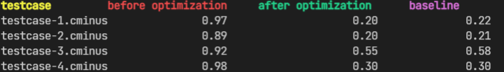

# Lab4 实验报告

小组成员 姓名 学号

袁玉润 PB19111692 (组长)

王历典 PB19111691

唐志鹏 PB19111690

## 实验要求

> 请按照自己的理解，写明本次实验需要干什么

本次实验借助lightIR, mem2reg, findLoop完成3个基本优化pass：

1. 常量传播

1. 循环不变量外提

1. 活跃变量分析

## 实验难点

> 实验中遇到哪些挑战

1. 在使用容器迭代器遍历过程中错误地使用迭代器修改容器内元素值，导致迭代器失效。
1. 理解IR中`Instruction`的构造，类似于树状结构。

## 实验设计

* 常量传播

    1. 实现思路：

       有以下3个地方的优化

       1. 将计算为常数的寄存器替换为字面常量，并将原寄存器赋值语句删除。

          这里的难点有

          1. 找到所有的运算

             包括整数/浮点的四则运算、比较运算、类型转换运算、位拓展运算。

          2. 注意在遍历bb的instructions顺序表时勿对其做修改，避免可能的Iterator失效等问题。使用延迟删除/增添

          3. 得益于SSA的特性，只需对流图做1次遍历，只要确保任意节点的支配节点在其之前被访问。本实现中使用DFS。

       2. 将条件为常值的条件br改为无条件br

          值得注意的有

          1. 修改后注意对流图进行修改（即调整前后继列表）。

       3. 对块内全局变量实现部分mem2reg

          仿照`mem2reg.cpp`中局部思路。由于不涉及块间调整，实现简单许多。

    2. 相应代码：

       1. 将计算为常数的寄存器替换为字面常量，并将原寄存器赋值语句删除。

          ```cpp
          for (auto instr : bb->get_instructions()){
              ...
              // `const_compute` is used to determine 
              // if the result is a constant at compile
              // time and, if it is, to compute the value. 
              auto res = const_compute(instr);
              if (res)
              {
                  instr->replace_all_use_with(res);
                  wait_delete.push_back(instr);
              }
              ...
          }
          ```

       2. 将条件为常值的条件br改为无条件br

          ```cpp
          for (auto instr : bb->get_instructions()){
              ...
              if (instr->is_br()) // instr is a branch instruction
              {
                  auto br_instr = dynamic_cast<BranchInst *>(instr);
                  if (br_instr->is_cond_br()) // instr is a conditional branch instruction
                  {
                      auto cond = dynamic_cast<ConstantInt *>(br_instr->get_operand(0));
                      if (cond) // The condition is a constant
                      {
                          auto cond_val = cond->get_value();
                          BasicBlock *goto_bb, *other_bb;
                          
                          // `goto_bb` is the block we branch unconditionally to. 
                          // `other_bb` will never be branched to. 
                          goto_bb = dynamic_cast<BasicBlock *>(br_instr->get_operand(2 - cond_val));
                          other_bb = dynamic_cast<BasicBlock *>(br_instr->get_operand(cond_val + 1));
                          
                          to_add_truebb = goto_bb;
                          wait_delete.push_back(instr);
                          
                          // Modify flow graph.
                          bb->remove_succ_basic_block(other_bb);
                          other_bb->remove_pre_basic_block(bb);
                      }
                  }
              }
              ...
          }
          
          // Add new br here
          ```

       3. 对块内全局变量实现部分mem2reg

          ```cpp
          for (auto instr : bb->get_instructions()){
              ...
              if (instr->is_store())
                  // `store` instructions are left unchanged, but 
                  // it is used to bookkeep the latest value of 
                  // a global variable. 
                  latest_val[instr->get_operand(1)] = instr->get_operand(0);
              else if (instr->is_load())
              {
                  if (latest_val.find(instr->get_operand(0)) == latest_val.end())
                      // If no register have latest value, a `load` is needed. 
                      latest_val[instr->get_operand(0)] = instr;
                  else
                  {
                      // Use the register to replace `load`
                      instr->replace_all_use_with(latest_val[instr->get_operand(0)]);
                      wait_delete.push_back(instr);
                  }
              }
              ...
          }
          ```

    3. 优化前后的IR对比（举一个例子）并辅以简单说明：

       以`testcase3`中`max`函数的`entry_basic_block`为例：

       ```c
       int max(void)
       {
       
       ========== Entry basic block ===========
           opa = 0*1*2*3*4*5*6*7;
           opb = 1*2*3*4*5*6*7*8;
           opc = 2*3*4*5*6*7*8*9;
           opd = 3*4*5*6*7*8*9*10;
       
           if( opa < opb){
       ========== Entry basic block ===========
       
               if( opb < opc){
                   if( opc < opd){
                       return opd;
                   }
               }
           }
           return 0;
       }
       ```

       优化前：

       ```llvm
       label_entry:
         %op0 = mul i32 0, 1
         %op1 = mul i32 %op0, 2
         %op2 = mul i32 %op1, 3
         %op3 = mul i32 %op2, 4
         %op4 = mul i32 %op3, 5
         %op5 = mul i32 %op4, 6
         %op6 = mul i32 %op5, 7
         store i32 %op6, i32* @opa
         %op7 = mul i32 1, 2
         %op8 = mul i32 %op7, 3
         %op9 = mul i32 %op8, 4
         %op10 = mul i32 %op9, 5
         %op11 = mul i32 %op10, 6
         %op12 = mul i32 %op11, 7
         %op13 = mul i32 %op12, 8
         store i32 %op13, i32* @opb
         %op14 = mul i32 2, 3
         %op15 = mul i32 %op14, 4
         %op16 = mul i32 %op15, 5
         %op17 = mul i32 %op16, 6
         %op18 = mul i32 %op17, 7
         %op19 = mul i32 %op18, 8
         %op20 = mul i32 %op19, 9
         store i32 %op20, i32* @opc
         %op21 = mul i32 3, 4
         %op22 = mul i32 %op21, 5
         %op23 = mul i32 %op22, 6
         %op24 = mul i32 %op23, 7
         %op25 = mul i32 %op24, 8
         %op26 = mul i32 %op25, 9
         %op27 = mul i32 %op26, 10
         store i32 %op27, i32* @opd
         %op28 = load i32, i32* @opa
         %op29 = load i32, i32* @opb
         %op30 = icmp slt i32 %op28, %op29
         %op31 = zext i1 %op30 to i32
         %op32 = icmp ne i32 %op31, 0
         br i1 %op32, label %label33, label %label39
       ```

       优化后：

       ```llvm
       label_entry:
         store i32 0, i32* @opa
         store i32 40320, i32* @opb
         store i32 362880, i32* @opc
         store i32 1814400, i32* @opd
         br label %label33
       ```

       可以看到

       1. 所有可计算的常量均以字面常量形式硬编码入IR
       2. 末尾的条件br被改为无条件br
       3. 对值为常量的全局变量引用不会引发`load`. 

    4. 运行结果

       


* 循环不变式外提
    实现思路：
    相应代码：
    优化前后的IR对比（举一个例子）并辅以简单说明：

    1. 实现思路：
        1. 循环不变式外提需要将与循环无关的计算提前在循环之前执行，遍历每个循环的基本块，找到循环不变式
        2. 遍历循环的顺序应该为：从内层循环开始向外层循环遍历，这样能保证循环不变式提到所能及的最外层循环
        3. 识别循环不变式的逻辑：指令的操作元满足下列任一条件
           - 操作元是常数
           - 操作元类型为`Instruction *`，且其`get_parent()`不在循环中
           - 操作元类型为`Instruction *`，且该指令也是循环不变式
        4. 遍历循环中基本块的顺序应该为：深度优先遍历
           - 
           - 比如，以上循环中`%a=1+1`和`%b=%a+1`都是循环不变式，如果先遍历基本块$\text{B}_3$，那么`%b=%a+1`就不会被识别为循环不变式
        5. 循环不变式外提的目标基本块应该为：循环`base`的不属于该循环的前继
        
    2. 相应代码：

        1. 遍历所有循环顺序为：从内层循环开始向外层循环遍历。实现为，从包含基本块数目最少的循环开始遍历

            ```c++
            // 获取函数的所有循环
            std::unordered_set<BBset_t *> loops = loop_searcher.get_loops_in_func(func);
            
            // 将循环按循环中块的个数排序，这样可以做到从最内存循环遍历所有循环
            std::vector<BBset_t *> loops_sorted{loops.begin(), loops.end()};
            std::sort(loops_sorted.begin(), loops_sorted.end(),
                [&](BBset_t *lhs, BBset_t *rhs)
                { return lhs->size() < rhs->size(); });
            ```

        2. 识别循环不变式需要判断指令的每个操作元是否满足可外提的条件

            ```c++
            auto to_instruction = [&](Value *v)
                { return dynamic_cast<Instruction *>(v); };
            auto to_const = [&](Value *v)
                { return dynamic_cast<ConstantInt *>(v) || dynamic_cast<ConstantFP *>(v); };
            
            bool can = false;
            
            // 遍历指令的每个操作元
            // 判断该操作元是否满足上述的三条条件中的任意一条
            for (auto op : instr->get_operands())
            {
                if(to_const(op))
                    can = true;
                if(to_instruction(op))
                {
                    auto parent = to_instruction(op)->get_parent();
                    if(loop->find(parent) == loop->end())
                        can = true;
                    else
                    {
                        for (auto del : wait_delete)
                        {
                            if (del == to_instruction(op))
                                can = true;
                        }
                    }
                }
                if(!can)
                    return false;
            }
            return can;
            ```

        3. 深度优先遍历循环中的所有基本块

            ```c++
            // 接着深度优先遍历node的后继
            for (auto succ = node->get_succ_basic_blocks().begin();
                 succ != node->get_succ_basic_blocks().end(); succ++)
            {
                    if ((visited.find(*succ) == visited.end()) && (loop->find(*succ) != loop->end()))
                        dfs(*succ, loop, loop_searcher);
            }
            ```

        4. 找到循环不变式外提的目标快

            ```c++
            // 找到循环外提的目标块：循环base的不属于该循环的前继
            auto base = loop_searcher.get_loop_base(loop);
            BasicBlock *target;
            for (auto prev : base->get_pre_basic_blocks())
                if (loop->find(prev) == loop->end())
                    target = prev;
            ```

    3. 优化前后的IR对比（举一个例子）并辅以简单说明：

        1. 对于样例`testcase-2`：

            ```c++
            void main(void){
                int i;
                int j;
                int a;
                int ret;
            
                i = 0;
                a = 2;
            
                while(i<10000000)
                {
                    j = 0;
            
                    while(j<2)
                    {
                        ret = (a*a*a*a*a*a*a*a*a*a)/a/a/a/a/a/a/a/a/a/a;
                        j=j+1;
                    }
                    i=i+1;
                }
            	output(ret);
                return ;
            }
            ```

        2. 赋值语句`ret = (a*a*a*a*a*a*a*a*a*a)/a/a/a/a/a/a/a/a/a/a;` 对于两层循环来说都是循环不变式，按我们实现的逻辑：应该先将其外提出最内层循环，然后外提出外层循环

        3. 优化前：该赋值语句在最内层循环

            ```c
            ; ModuleID = 'cminus'
            source_filename = "../tests/4-ir-opt/testcases/LoopInvHoist/testcase-2.cminus"
            
            declare i32 @input()
            
            declare void @output(i32)
            
            declare void @outputFloat(float)
            
            declare void @neg_idx_except()
            
            define void @main() {
            label_entry:
              br label %label4
            label4:                                                ; preds = %label_entry, %label59
              %op62 = phi i32 [ %op65, %label59 ], [ undef, %label_entry ]
              %op63 = phi i32 [ 0, %label_entry ], [ %op61, %label59 ]
              %op64 = phi i32 [ %op66, %label59 ], [ undef, %label_entry ]
              %op6 = icmp slt i32 %op63, 10000000
              %op7 = zext i1 %op6 to i32
              %op8 = icmp ne i32 %op7, 0
              br i1 %op8, label %label9, label %label10
            label9:                                                ; preds = %label4
              br label %label12
            label10:                                                ; preds = %label4
              call void @output(i32 %op62)
              ret void
            label12:                                                ; preds = %label9, %label17
              %op65 = phi i32 [ %op62, %label9 ], [ %op56, %label17 ]
              %op66 = phi i32 [ 0, %label9 ], [ %op58, %label17 ]
              %op14 = icmp slt i32 %op66, 2
              %op15 = zext i1 %op14 to i32
              %op16 = icmp ne i32 %op15, 0
              br i1 %op16, label %label17, label %label59
            label17:                                                ; preds = %label12
            
            ============================== 这是优化前赋值语句的开始位置 ===========================
              %op20 = mul i32 2, 2
              %op22 = mul i32 %op20, 2
              %op24 = mul i32 %op22, 2
              %op26 = mul i32 %op24, 2
              %op28 = mul i32 %op26, 2
              %op30 = mul i32 %op28, 2
              %op32 = mul i32 %op30, 2
              %op34 = mul i32 %op32, 2
              %op36 = mul i32 %op34, 2
              %op38 = sdiv i32 %op36, 2
              %op40 = sdiv i32 %op38, 2
              %op42 = sdiv i32 %op40, 2
              %op44 = sdiv i32 %op42, 2
              %op46 = sdiv i32 %op44, 2
              %op48 = sdiv i32 %op46, 2
              %op50 = sdiv i32 %op48, 2
              %op52 = sdiv i32 %op50, 2
              %op54 = sdiv i32 %op52, 2
              %op56 = sdiv i32 %op54, 2
              %op58 = add i32 %op66, 1
            ============================== 这是优化前赋值语句的结束位置 ===========================
                
              br label %label12
            label59:                                                ; preds = %label12
              %op61 = add i32 %op63, 1
              br label %label4
            }
            ```

            

        4. 优化后：该赋值语句在循环外

            ```c
            ; ModuleID = 'cminus'
            source_filename = "../tests/4-ir-opt/testcases/LoopInvHoist/testcase-2.cminus"
            
            declare i32 @input()
            
            declare void @output(i32)
            
            declare void @outputFloat(float)
            
            declare void @neg_idx_except()
            
            define void @main() {
            label_entry:
                
            ============================== 这是优化后赋值语句的开始位置 ===========================
              %op20 = mul i32 2, 2
              %op22 = mul i32 %op20, 2
              %op24 = mul i32 %op22, 2
              %op26 = mul i32 %op24, 2
              %op28 = mul i32 %op26, 2
              %op30 = mul i32 %op28, 2
              %op32 = mul i32 %op30, 2
              %op34 = mul i32 %op32, 2
              %op36 = mul i32 %op34, 2
              %op38 = sdiv i32 %op36, 2
              %op40 = sdiv i32 %op38, 2
              %op42 = sdiv i32 %op40, 2
              %op44 = sdiv i32 %op42, 2
              %op46 = sdiv i32 %op44, 2
              %op48 = sdiv i32 %op46, 2
              %op50 = sdiv i32 %op48, 2
              %op52 = sdiv i32 %op50, 2
              %op54 = sdiv i32 %op52, 2
              %op56 = sdiv i32 %op54, 2
            ============================== 这是优化后赋值语句的结束位置 ===========================
                
              br label %label4
            label4:                                                ; preds = %label_entry, %label59
              %op62 = phi i32 [ %op65, %label59 ], [ undef, %label_entry ]
              %op63 = phi i32 [ 0, %label_entry ], [ %op61, %label59 ]
              %op64 = phi i32 [ %op66, %label59 ], [ undef, %label_entry ]
              %op6 = icmp slt i32 %op63, 10000000
              %op7 = zext i1 %op6 to i32
              %op8 = icmp ne i32 %op7, 0
              br i1 %op8, label %label9, label %label10
            label9:                                                ; preds = %label4
              br label %label12
            label10:                                                ; preds = %label4
              call void @output(i32 %op62)
              ret void
            label12:                                                ; preds = %label9, %label17
              %op65 = phi i32 [ %op62, %label9 ], [ %op56, %label17 ]
              %op66 = phi i32 [ 0, %label9 ], [ %op58, %label17 ]
              %op14 = icmp slt i32 %op66, 2
              %op15 = zext i1 %op14 to i32
              %op16 = icmp ne i32 %op15, 0
              br i1 %op16, label %label17, label %label59
            label17:                                                ; preds = %label12
              %op58 = add i32 %op66, 1
              br label %label12
            label59:                                                ; preds = %label12
              %op61 = add i32 %op63, 1
              br label %label4
            }
            ```

            

* 活跃变量分析
  
    ​	实现思路：
    
    ​	整体上使用课本上的算法，流程如下：
    
    1. 初始化每个块的`OUT[B],IN[B],DEF[B],USE[B]`集合，但实验中由于我们认为`phi`函数中的变量只在对应的块中保持活跃，因此仍需要记录每个块的`phi`函数中基本块与变量的对应以便后续使用。
    
    2. 遍历所有的块按照以下公式来计算每个块的`OUT,IN`集合，直到所有的`IN[B]`集合不再改变。
    
       但有一点需要注意，在循环时IN的集合中不应有PHI中的变量，需要在循环结束后再填入。
    
    $$
    \begin{aligned}
    OUT[B] &= \cup(IN[S]\cup PHI_S[B]), S \in B.succ\\
    IN[B] &= USE[B] \cup(OUT[B] - DEF[B])
    \end{aligned}
    $$
    
    
    
    ​	相应的代码：
    
    		1. 数据结构：
    
    ```c++
    set<Value*> DEF;//单个块DEF集合，通过变量索引
    set<Value*> USE;//单块USE集合，通过变量索引
    map<Value*, set<Value*> > PHI_USES;//单块Phi_user集合，通过前驱块索引，得到前驱块对应的需要phi的变量。
    map<BasicBlock*, set<Value*> > live_use;//函数中的USE集合的集合，通过BB块索引，得到对应BB块的USE集合
    map<BasicBlock*, set<Value*> > live_def;//函数中的USE集合的集合，通过BB块索引，得到对应BB块的USE集合
    map<BasicBlock*, map<Value*, set<Value*> > > live_phi_use;//函数中的PHImap的集合，通过BB块索引，得到对应bb块的PHI map
    ```
    
    2. 各阶段代码:
    
       1. 初始化：
    
       ```c++
       map<BasicBlock*, set<Value*> > live_use;
       map<BasicBlock*, set<Value*> > live_def;
       map<BasicBlock*, map<Value*, set<Value*> > > live_phi_use;
       // 在此分析 func_ 的每个bb块的活跃变量，并存储在 live_in live_out 结构内
       for(auto bb : func_->get_basic_blocks())
       {
           set<Value*> DEF;//DEF集合
           set<Value*> USE;//USE集合
           map<Value*, set<Value*> > PHI_USES;//Phi_user集合
           live_in.insert(pair<BasicBlock *, set<Value *> >{bb,set<Value*>()});
           live_out.insert(pair<BasicBlock *, set<Value *> >{bb,set<Value*>()});
           for(auto inst : bb->get_instructions())
           {
               if(inst->is_ret() || inst->is_store() || inst->is_br())//这三种命令不会对DEF更新
               {
                   for(auto op : inst->get_operands())
                   {
                       if(DEF.find(op) == DEF.end() && !dynamic_cast<Constant *>(op) && !dynamic_cast<BasicBlock*>(op))//排除各语句中的常数和br命令中可能出现的bb块
                           USE.insert(op);
                   }
               }//if(inst->is_void())
               else if(inst->is_phi())//phi语句单独处理
               {
                   DEF.insert(inst);//由于是静态单赋值，可以在判断use之前直接更新def
                   auto op_list = inst->get_operands();
                   for(int i = 0; i < op_list.size() / 2; i++)//phi中的数据对为[变量,bb] ，即偶数下标对应的是变量，奇数下标对应的是bb块
                   {
                       if(dynamic_cast<Constant *>(op_list[2 * i])) continue;
                       auto it = PHI_USES.find(op_list[2*i + 1]);
                       if( it == PHI_USES.end())//不能找到，为此bb新建phi集合
                       {
                           set<Value *> phi_value;
                           phi_value.insert(op_list[2*i]);
                           PHI_USES.insert(pair<Value*, set<Value*> >{op_list[2*i+1],phi_value});
                       }
                       else//可以找到，在此bb的phi集合中插入value。
                       {
                           it->second.insert(op_list[2*i]);
                       }
                   }
               }//else if(inst->is_phi())
               else if(inst->is_call())
               {
                   auto op_list = inst->get_operands();
                   for(int i = 1; i < op_list.size(); i++)
                   {
                       if(DEF.find(op_list[i]) == DEF.end() && !dynamic_cast<Constant *>(op_list[i]))
                           USE.insert(op_list[i]);
                   }
                   if(!inst->get_type()->is_void_type())//call可能没有返回值，因此对def的更新需要判断。
                   {
                       if(USE.find(inst) == USE.end())
                           DEF.insert(inst);
                   }
               }//else if(inst->is_call())
               else//其余指令均可以用下述通用代码初始化
               {
                   for(auto op : inst->get_operands())
                   {
                       if(DEF.find(op) == DEF.end() && !dynamic_cast<Constant *>(op))
                           USE.insert(op);
                   }
                   if(USE.find(inst) == USE.end())
                       DEF.insert(inst);
               }//else
           }//for(auto inst : bb->get_instructions())
       
           live_use.insert(pair<BasicBlock*, set<Value*> >{bb,USE});
           live_def.insert(pair<BasicBlock*, set<Value*> >{bb,DEF});
           live_phi_use.insert(pair<BasicBlock*, map<Value*, set<Value*> > >{bb,PHI_USES});
       }
       ```
    
       2. 算法：
    
       ```c++
       bool is_in_modified = true;//用于判断in是否有修改
       while(is_in_modified)
       {
           is_in_modified = false;
           for(auto bb : func_->get_basic_blocks())
           {
               auto &out = live_out.find(bb)->second;
               auto &in = live_in.find(bb)->second;
               //OUT[B] = U IN[S] U PHI[S,B]
               for(auto succ: bb->get_succ_basic_blocks())
               {
                   const auto &in_succ = live_in.find(succ)->second;
                   for(auto value : in_succ)
                       out.insert(value);
                   const auto &succ_phi_list = live_phi_use.find(succ)->second;
                   auto it = succ_phi_list.find(bb);
                   if(it == succ_phi_list.end()) continue;
                   const auto &succ_phi = it->second;
                   for(auto value : succ_phi)
                       out.insert(value);
               }
               //IN[B] = USE[B] U (OUT[B] - DEF[B])
       
               auto bb_def = live_def.find(bb)->second;
               auto bb_use = live_use.find(bb)->second;
               set<Value*> Right_set;
               // SetDifference(out, bb_def, Right_set);
       		set_difference( out.begin(), out.end(), bb_def.begin(), bb_def.end(), inserter(Right_set, Right_set.begin()) );//集合做差
               for(auto value : Right_set)
               {
                   auto check = in.insert(value);
                   if(check.second) is_in_modified = true;
               }
               for(auto value : bb_use)
               {
                   auto check = in.insert(value);
                   if(check.second) is_in_modified = true;
               }
           }//for(bb)
       }//while
       //将phi集合与in集合合并
       for(auto bb : func_->get_basic_blocks())
       {
           auto &in = live_in.find(bb)->second;
           auto phi_list_map = live_phi_use.find(bb)->second;
           for(auto &phi_list_it : phi_list_map)
           {
               auto &phi_list = phi_list_it.second;
               for(auto value : phi_list)
               {
                   if(dynamic_cast<Constant*>(value)) continue;
                   in.insert(value);
               }
           }
       }
       ```
    
       实验结果：
    
       

### 实验总结

> 此次实验有什么收获

加深了对3种优化方法的理解，实现过程中相较于理论学习关注了更多细节。

体会到SSA对优化的便利。

通过阅读lightIR加深了对C++中继承、动态类型的理解。

### 实验反馈 （可选 不会评分）

对本次实验的建议

### 组间交流 （可选）

本次实验和哪些组（记录组长学号）交流了哪一部分信息